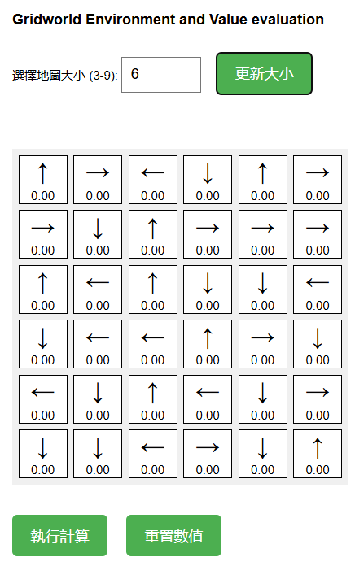
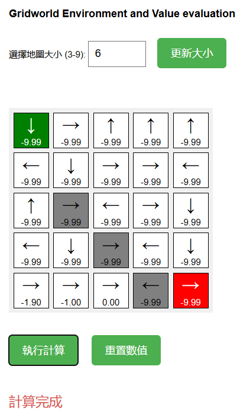

# DRL_HW01

## Gridworld Environment and Value Evaluation

本專案是一個結合 **Flask + HTML + jQuery** 的 Web 應用系統，用來模擬一個互動式的 GridWorld 強化學習環境，實作內容包含以下幾個重點功能：

### 1.概敘說明

#### 🎯 專案目的
建立一個可互動的 `n x n` 格子地圖，讓使用者可以：
- 自訂地圖大小（n 介於 3~9）
- 手動設定起點（綠色）、終點（紅色）、障礙格（灰色，最多 n-2 個）
- 對每個格子隨機指定一個動作方向（↑、↓、←、→）作為固定策略 π(s)
- 執行 **策略評估演算法**（Value Iteration）計算每格的價值 V(s)
- 在網頁前端即時顯示每格的箭頭與價值結果

---

#### ⚙️ 專案特點一覽

| 功能              | 說明 |
|-------------------|------|
| ✅ 格子地圖產生    | 使用者輸入 n 值後，後端重新建立 n x n 地圖 |
| ✅ 格子狀態設定    | 點擊格子即可依序設定起點、終點與障礙 |
| ✅ 隨機策略分配    | 每格自動指派一個方向作為動作策略 π(s) |
| ✅ 策略評估計算    | 透過 Flask 後端執行 Bellman Equation 計算 V(s) |
| ✅ 即時前端顯示    | 每格以箭頭顯示策略、文字顯示 V(s) 值 |
| ✅ 數值重置功能    | 可清除所有格子的 V 值重新進行策略評估 |

---

#### 🧠 教學與展示目的
此作業的核心在於透過互動式介面學習與理解以下概念：

- 策略（Policy）的表示方式與隨機初始化
- 策略評估（Policy Evaluation）的計算邏輯與收斂條件
- 狀態價值函數 V(s) 的視覺化
- 如何將強化學習環境以 Web 應用方式呈現與操作

---
### 2.Code
##### app.py
```python
from flask import Flask, render_template, request, jsonify
import random
import numpy as np

app = Flask(__name__)

# 初始化地圖
n = 5  # 預設大小
grid = [["" for _ in range(n)] for _ in range(n)]
start = None
end = None
obstacles = set()
actions = ["↑", "↓", "←", "→"]
policy = [[random.choice(actions) for _ in range(n)] for _ in range(n)]
value_function = np.zeros((n, n))

def evaluate_policy():
    """簡單的政策評估，計算 V(s)"""
    global value_function
    gamma = 0.9  # 折扣因子
    delta = 1e-3  # 收斂閾值

    while True:
        new_value_function = np.copy(value_function)
        for i in range(n):
            for j in range(n):
                if (i, j) in obstacles or (i, j) == start or (i, j) == end:
                    continue
                action = policy[i][j]
                ni, nj = i, j
                if action == "↑" and i > 0: ni -= 1
                elif action == "↓" and i < n-1: ni += 1
                elif action == "←" and j > 0: nj -= 1
                elif action == "→" and j < n-1: nj += 1
                new_value_function[i, j] = -1 + gamma * value_function[ni, nj]

        if np.max(np.abs(new_value_function - value_function)) < delta:
            break
        value_function = new_value_function

@app.route('/')
def index():
    return render_template("index.html", n=n, grid=grid, policy=policy, value_function=value_function.tolist())

@app.route('/set_size', methods=['POST'])
def set_size():
    global n, grid, policy, value_function, obstacles, start, end
    data = request.json
    n = data["size"]
    grid = [["" for _ in range(n)] for _ in range(n)]
    policy = [[random.choice(actions) for _ in range(n)] for _ in range(n)]
    value_function = np.zeros((n, n))
    obstacles.clear()
    start = None
    end = None
    return jsonify({
        "message": "Grid size updated", 
        "n": n, 
        "policy": policy, 
        "values": value_function.tolist()
    })

@app.route('/update_cell', methods=['POST'])
def update_cell():
    global start, end, obstacles
    data = request.json
    x, y = data["x"], data["y"]

    # 點擊設置起點、終點和障礙物
    if (x, y) == start:
        start = None  # 移除起點
        return jsonify({"message": "Start removed"})
    elif (x, y) == end:
        end = None  # 移除終點
        return jsonify({"message": "End removed"})
    elif (x, y) in obstacles:
        obstacles.remove((x, y))  # 移除障礙物
        return jsonify({"message": "Obstacle removed"})
    
    if not start:  # 如果沒有設置起點，設置為起點
        start = (x, y)
        return jsonify({"message": "Start set"})
    elif not end:  # 如果沒有設置終點，設置為終點
        end = (x, y)
        return jsonify({"message": "End set"})
    else:  # 若已經設置了起點和終點，設置為障礙物
        obstacles.add((x, y))
        return jsonify({"message": "Obstacle set"})

@app.route('/evaluate_policy', methods=['POST'])
def evaluate():
    evaluate_policy()
    return jsonify({"message": "Policy evaluated", "values": value_function.tolist()})

@app.route('/reset_values', methods=['POST'])
def reset_values():
    global value_function
    value_function = np.zeros((n, n))
    return jsonify({"message": "Values reset", "values": value_function.tolist()})

if __name__ == "__main__":
    app.run(debug=True)

```

#### index.html
```html
<!DOCTYPE html>
<html lang="zh">
<head>
    <meta charset="UTF-8">
    <meta name="viewport" content="width=device-width, initial-scale=1.0">
    <title>Gridworld Environment and Value evaluation</title>
    <script src="https://code.jquery.com/jquery-3.6.0.min.js"></script>
    <style>
        body {
            font-family: Arial, sans-serif;
            margin: 20px;
        }
        .grid-container {
            display: grid;
            gap: 5px; /* 增加格子間距 */
            margin: 20px 0;
        }
        .cell {
            width: 60px; /* 增加格子大小 */
            height: 60px;
            border: 1px solid black;
            text-align: center;
            font-size: 18px;
            display: flex;
            flex-direction: column;
            align-items: center;
            justify-content: center;
            cursor: pointer;
            position: relative;
        }
        .start { background-color: green; color: white; }
        .end { background-color: red; color: white; }
        .obstacle { background-color: gray; }
        .policy {
            font-size: 24px;
            margin-bottom: 2px;
        }
        .value {
            font-size: 12px;
        }
        
        /* 按鈕樣式 */
        button {
            background-color: #4CAF50;
            color: white;
            padding: 12px 20px;
            border: none;
            border-radius: 4px;
            cursor: pointer;
            font-size: 16px;
            margin-right: 15px;
            margin-top: 10px;
            margin-bottom: 10px;
        }
        
        button:hover {
            background-color: #45a049;
        }
        
        /* 輸入框樣式 */
        input[type="number"] {
            padding: 10px;
            width: 60px;
            margin-right: 10px;
            font-size: 16px;
        }
        
        /* 控制區域樣式 */
        .controls {
            margin-bottom: 20px;
        }
        
        /* 狀態訊息樣式 */
        #status {
            font-size: 18px;
            color: #d9534f;
            margin-top: 15px;
            height: 25px;
        }
    </style>
</head>
<body>

    <h2>Gridworld Environment and Value evaluation</h2>
    
    <div class="controls">
        <label for="size">選擇地圖大小 (3-9): </label>
        <input type="number" id="size" min="3" max="9" value="{{ n }}">
        <button onclick="setGridSize()">更新大小</button>
    </div>

    <div id="grid" class="grid-container"></div>
    
    <div class="controls">
        <button onclick="evaluatePolicy()">執行計算</button>
        <button onclick="resetValues()">重置數值</button>
    </div>
    
    <div id="status"></div>

    <script>
        let n = {{ n }};
        let start = null;
        let end = null;
        let obstacles = new Set();
        let policy = {{ policy|tojson }};
        let values = {{ value_function|tojson }};

        function generateGrid() {
            $("#grid").empty().css("grid-template-columns", `repeat(${n}, 60px)`); // 更新為新的格子大小
            for (let i = 0; i < n; i++) {
                for (let j = 0; j < n; j++) {
                    let cell = $("<div>").addClass("cell").attr("data-x", i).attr("data-y", j);
                    
                    // 添加政策箭頭
                    let policyDiv = $("<div>").addClass("policy").text(policy[i][j]);
                    cell.append(policyDiv);
                    
                    // 添加價值函數
                    let valueDiv = $("<div>").addClass("value").text(values[i][j].toFixed(2));
                    cell.append(valueDiv);
                    
                    cell.click(() => updateCell(i, j)); // 點擊格子觸發事件
                    $("#grid").append(cell);
                }
            }
            
            // 重新標記起點、終點和障礙物
            if (start) {
                $(`.cell[data-x=${start[0]}][data-y=${start[1]}]`).addClass("start");
            }
            if (end) {
                $(`.cell[data-x=${end[0]}][data-y=${end[1]}]`).addClass("end");
            }
            obstacles.forEach(obs => {
                const [x, y] = obs.split(',').map(Number);
                $(`.cell[data-x=${x}][data-y=${y}]`).addClass("obstacle");
            });
        }

        function setGridSize() {
            let size = $("#size").val();
            $.ajax({
                url: "/set_size",
                type: "POST",
                contentType: "application/json",
                data: JSON.stringify({ size: parseInt(size) }),
                success: function(data) {
                    n = data.n;
                    policy = data.policy;
                    values = data.values;
                    resetObstaclesStartEnd();
                    generateGrid();
                }
            });
        }

        function resetObstaclesStartEnd() {
            obstacles = new Set();
            start = null;
            end = null;
        }

        function updateCell(x, y) {
            // 檢查是否點擊的是起點
            if (start && start[0] === x && start[1] === y) {
                $(".start").removeClass("start");
                start = null;
                return;
            }
            // 檢查是否點擊的是終點
            if (end && end[0] === x && end[1] === y) {
                $(".end").removeClass("end");
                end = null;
                return;
            }
            // 檢查是否點擊的是障礙物
            if (obstacles.has(`${x},${y}`)) {
                // 立即移除樣式，然後發送請求
                let cell = $(`.cell[data-x=${x}][data-y=${y}]`);
                cell.removeClass("obstacle");
                obstacles.delete(`${x},${y}`);
                
                $.ajax({
                    url: "/update_cell",
                    type: "POST",
                    contentType: "application/json",
                    data: JSON.stringify({ x, y, type: "obstacle" }),
                    error: function() {
                        // 如果請求失敗，恢復障礙物
                        cell.addClass("obstacle");
                        obstacles.add(`${x},${y}`);
                    }
                });
                return;
            }

            // 設置新的起點
            if (!start) {
                // 立即添加樣式，然後發送請求
                let cell = $(`.cell[data-x=${x}][data-y=${y}]`);
                cell.addClass("start");
                start = [x, y];
                
                $.ajax({
                    url: "/update_cell",
                    type: "POST",
                    contentType: "application/json",
                    data: JSON.stringify({ x, y, type: "start" }),
                    error: function() {
                        // 如果請求失敗，恢復狀態
                        cell.removeClass("start");
                        start = null;
                    }
                });
                return;
            }

            // 設置終點
            if (!end) {
                // 立即添加樣式，然後發送請求
                let cell = $(`.cell[data-x=${x}][data-y=${y}]`);
                cell.addClass("end");
                end = [x, y];
                
                $.ajax({
                    url: "/update_cell",
                    type: "POST",
                    contentType: "application/json",
                    data: JSON.stringify({ x, y, type: "end" }),
                    error: function() {
                        // 如果請求失敗，恢復狀態
                        cell.removeClass("end");
                        end = null;
                    }
                });
                return;
            }

            // 設置障礙物（如果還沒達到上限）
            if (obstacles.size < n - 2) {
                // 立即添加樣式，然後發送請求
                let cell = $(`.cell[data-x=${x}][data-y=${y}]`);
                cell.addClass("obstacle");
                obstacles.add(`${x},${y}`);
                
                $.ajax({
                    url: "/update_cell",
                    type: "POST",
                    contentType: "application/json",
                    data: JSON.stringify({ x, y, type: "obstacle" }),
                    error: function() {
                        // 如果請求失敗，恢復狀態
                        cell.removeClass("obstacle");
                        obstacles.delete(`${x},${y}`);
                    }
                });
            } else {
                $("#status").text(`已達到障礙物數量上限 (${n-2} 個)`);
                setTimeout(() => $("#status").text(""), 3000);
            }

            // 在點擊障礙物按鈕後添加這段代碼
            console.log("障礙物設置:", x, y);
            console.log("障礙物當前數量:", obstacles.size);
            console.log("cell元素:", $(`.cell[data-x=${x}][data-y=${y}]`));
        }

        function evaluatePolicy() {
            $("#status").text("計算中...");
            $.ajax({
                url: "/evaluate_policy",
                type: "POST",
                contentType: "application/json",
                success: function(data) {
                    values = data.values;
                    for (let i = 0; i < n; i++) {
                        for (let j = 0; j < n; j++) {
                            $(`.cell[data-x=${i}][data-y=${j}] .value`).text(values[i][j].toFixed(2));
                        }
                    }
                    $("#status").text("計算完成");
                }
            });
        }
        
        function resetValues() {
            $.ajax({
                url: "/reset_values",
                type: "POST",
                contentType: "application/json",
                success: function(data) {
                    values = data.values;
                    for (let i = 0; i < n; i++) {
                        for (let j = 0; j < n; j++) {
                            $(`.cell[data-x=${i}][data-y=${j}] .value`).text(values[i][j].toFixed(2));
                        }
                    }
                    $("#status").text("數值已重置");
                }
            });
        }

        $(document).ready(() => generateGrid());
    </script>

</body>
</html>

```


---

#### 📁 `app.py` 解說（Flask 後端）

##### 🔹 初始化區塊

```python
n = 5
grid = [["" for _ in range(n)] for _ in range(n)]
start = None
end = None
obstacles = set()
actions = ["↑", "↓", "←", "→"]
policy = [[random.choice(actions) for _ in range(n)] for _ in range(n)]
value_function = np.zeros((n, n))
```

- 建立 `n x n` 地圖、隨機策略與初始化狀態價值 \( V(s) \)
- `start`, `end`, `obstacles` 記錄互動狀態

---

##### 🔹 策略評估函數 `evaluate_policy`

```python
def evaluate_policy():
    ...
```

- 使用貝爾曼方程式，根據目前策略 `policy` 計算 `value_function`
- 使用折扣因子 γ = 0.9，並重複更新直到收斂

---

##### 🔹 Flask 路由說明

| 路由 | 功能 |
|------|------|
| `/` | 主頁，渲染地圖畫面 |
| `/set_size` | 接收地圖大小，重設地圖與策略 |
| `/update_cell` | 更新格子狀態（起點、終點、障礙） |
| `/evaluate_policy` | 執行策略評估 |
| `/reset_values` | 重置所有 `V(s)` 值為 0 |

---

#### 🖥️ `index.html` 解說（前端畫面）

##### 🔹 HTML 功能概覽

```html
<input type="number" id="size" min="3" max="9">
<button onclick="setGridSize()">更新大小</button>
```

- 用來調整地圖大小（3~9）

```html
<div id="grid" class="grid-container"></div>
```

- 地圖格子容器，格子由 JS 動態產生

```html
<button onclick="evaluatePolicy()">執行計算</button>
<button onclick="resetValues()">重置數值</button>
```

- 控制策略評估與重置值函數

---

##### 🎨 CSS 樣式亮點

- `.cell` 是每個格子，大小為 100x100px，內含：
  - `.policy`：顯示箭頭（策略）
  - `.value`：顯示該狀態的 V(s)
- `.start`, `.end`, `.obstacle` 用不同背景色標記

---

##### 🔸 JavaScript 核心功能

##### `generateGrid()`

- 建立地圖格子，將 `policy` 與 `V(s)` 寫入每格
- 套用起點、終點與障礙物的樣式
- 綁定每格的點擊事件 → `updateCell(x, y)`

---

##### `setGridSize()`

```js
function setGridSize() {
    ...
}
```

- 發送 POST 請求給 `/set_size`
- 從後端接收新的地圖大小與資料，重新繪製

---

##### `updateCell(x, y)`

- 點擊格子依序設為：
  1. 起點（start）
  2. 終點（end）
  3. 障礙物（obstacle）
- 若重複點擊會移除對應設定（toggle）
- 會即時更新樣式 + 非同步請求後端 `/update_cell`

---

##### `evaluatePolicy()`

```js
function evaluatePolicy() {
    ...
}
```

- 呼叫 `/evaluate_policy`，從後端取得新的 `V(s)`
- 即時更新畫面上每個格子的數值

---

##### `resetValues()`

- 呼叫 `/reset_values`
- 將所有格子的 V(s) 顯示重設為 0

---

##### ✅ 小結功能表

| 功能 | 說明 |
|------|------|
| 地圖動態產生 | JS `generateGrid()` 根據策略與值產生畫面 |
| 點擊設定角色 | `updateCell()` 控制起點、終點與障礙物 |
| 策略評估 | `/evaluate_policy` 後端運算 V(s) |
| 重設值函數 | `/reset_values` 將 V(s) 清空 |
| 使用者體驗 | 即時樣式更新、狀態提示文字、錯誤處理 |

---

### 3.Prompt 規劃概念（分階段引導生成）
#### ✅ Step 1 — 初始化 Flask 與 GridWorld 狀態

請幫我建立一個 Flask 網頁應用程式，這個應用要用來建立一個 `n x n` 的 GridWorld。請初始化以下內容：

1. 使用變數 `n = 5` 作為預設地圖大小
2. 建立一個 `grid`，使用 2D list 表示地圖
3. 初始化一個隨機策略 policy（每格都是 ↑↓←→ 四個方向隨機之一）
4. 使用 NumPy 初始化一個全為 0 的 `value_function`，大小為 `n x n`

這一階段不需要任何 HTML 前端，只要後端的 app.py。

#### ✅ Step 2 — 加入策略評估函數 evaluate_policy()
請在剛剛的 Flask 程式中加入一個 `evaluate_policy()` 函數，用來根據目前的策略 `policy` 更新 value function `V(s)`。

- 每個狀態有一個策略箭頭（↑↓←→），指示下一步的方向
- 若移動會撞牆則保持原地
- 每移動一步 cost 為 -1
- 使用折扣因子 γ = 0.9
- 每次更新使用 Bellman expectation 方式，直到最大變動小於 1e-3 為止（delta < 1e-3）

你可以使用 NumPy 來更新 `value_function`。

#### ✅ Step 3 — 建立前端：顯示網格、策略與 V(s)
請幫我撰寫一個對應於剛剛 Flask app 的 HTML 前端（index.html），功能如下：

1. 使用 `<div>` 建立 `n x n` 的格子（用 CSS Grid 呈現）
2. 每個格子要顯示兩個元素：一個是箭頭（↑↓←→），來自策略 policy，另一個是 value function 值（浮點數，顯示小數點後兩位）
3. 提供一個數字輸入框來設定地圖大小 (3~9)，並有一個按鈕觸發 `/set_size` 更新後端資料
4. 提供按鈕來呼叫 `/evaluate_policy` 計算，與 `/reset_values` 重置所有 V(s)

請加上基礎 CSS 讓格子整齊，字體清楚。

#### ✅ Step 4 — 點擊互動：設定起點、終點與障礙物
請在剛剛的 GridWorld 中加入互動功能，讓使用者點擊格子時可依序設定以下角色：

1. 第一個點擊為起點（start），顯示綠色
2. 第二個點擊為終點（end），顯示紅色
3. 接下來所有點擊為障礙物（obstacle），顯示灰色
4. 若再次點擊相同格子，則取消該設定（toggle）

請建立一個 `/update_cell` 的 POST API，在後端記錄這些格子角色，並回傳狀態更新給前端。前端要能根據回傳結果即時改變格子樣式（例如 `.start`, `.end`, `.obstacle`）。

#### ✅ Step 5 — 前端整合策略評估與數值更新
請讓 HTML 前端的「執行計算」按鈕觸發 `/evaluate_policy` API，從後端取得最新的 value function，然後更新畫面中每個格子的數值顯示。

另外，請實作「重置數值」按鈕，呼叫 `/reset_values` 並將畫面中的所有 V(s) 顯示為 0。

每次計算或重置完成後，顯示一行文字表示執行狀態，例如「計算完成」或「數值已重置」。


### 4.Value Iteration 策略評估與最佳化筆記
#### 📘 什麼是 Value Iteration？

Value Iteration（價值迭代）是一種用於解決 **馬可夫決策過程（MDP）** 的強化學習演算法。

它的核心目標是透過反覆計算每個狀態的「價值函數」\( V(s) \)，直到收斂，並根據這些價值決定最優策略 \( \pi^*(s) \)。

---

#### 📐 基本步驟

1. 重複以下步驟直到收斂：
    - 對每個狀態 $s$，使用貝爾曼最佳化方程式更新：

      $$
      V(s) = \max_a \sum_{s'} P(s' \mid s, a) \left[ R(s, a, s') + \gamma V(s') \right]
      $$
      其中：
      - $P(s' \mid s, a)$：採取動作 $a$ 轉移到 $s'$ 的機率  
      - $R(s, a, s')$：此轉移的獎勵（可簡化為 -1）  
      - $\gamma$：折扣因子（0~1）

3. 根據最終的 \( V(s) \) 計算最優策略：

$$
\pi^*(s) = \arg\max_a \sum_{s'} P(s' \mid s, a) \left[ R(s, a, s') + \gamma V(s') \right]
$$

---

#### ✅ 優點

- 理論上能計算出全域最優策略
- 每一步都有明確的數學依據

---

#### ⚠️ 缺點

- 必須知道完整的轉移模型
- 對於大型狀態空間速度慢、記憶體需求大

---
#### 🔚 小結

Value Iteration 是強化學習中的經典演算法，適合用來學習強化學習的核心概念，並可作為後續更複雜方法的基礎。


### 5.Prompt 規劃概念（分階段引導生成）
Demo 流程 — 執行 Flask GridWorld 的步驟

---

#### ✅ 1. 啟動後端 Flask 伺服器

在終端機執行以下指令（假設你的檔名為 `app.py`）：

```bash
python app.py
```

若設定正確，會看到：

```
 * Running on http://127.0.0.1:5000/
```

---

#### ✅ 2. 開啟瀏覽器，進入應用首頁

網址輸入：

```
http://127.0.0.1:5000/
```

此時網頁會載入 GridWorld 地圖，預設為 5x5 格子，每個格子顯示：

- 策略箭頭（↑↓←→）
- 初始 value 值：皆為 0.00

---

#### ✅ 3. 操作地圖格子（設定狀態）

在網頁上點擊格子依序完成以下設定：

1. 第一次點擊 → 設為 **起點**（綠色）
2. 第二次點擊 → 設為 **終點**（紅色）
3. 第三次以後 → 設為 **障礙物**（灰色，可多格）

點擊已設格子可 **取消設定**

---

#### ✅ 4. 更改地圖大小（可選）

- 使用輸入框更改地圖尺寸（3~9）
- 點擊「更新大小」按鈕重新載入地圖與隨機策略

---

#### ✅ 5. 執行策略評估

點擊 **「執行計算」** 按鈕：

- 會向後端 `/evaluate_policy` 傳送請求
- 後端執行 `evaluate_policy()` 計算每格的 $V(s)$ 值
- 前端自動更新每格數值

狀態欄會顯示「計算完成」

---

#### ✅ 6. 重置狀態值（可選）

點擊 **「重置數值」** 按鈕：

- 所有格子的 $V(s)$ 會重設為 0
- 可重新開始策略模擬

---

#### 📘 總結：整體互動流程一覽

| 步驟 | 操作說明 |
|------|----------|
| 啟動伺服器 | `python app.py` |
| 開啟網頁 | http://127.0.0.1:5000 |
| 設定格子 | 點擊起點 ➝ 終點 ➝ 障礙物 |
| 改變地圖大小 | 輸入新數字並點「更新大小」 |
| 執行評估 | 點「執行計算」取得 $V(s)$ |
| 重置數值 | 點「重置數值」恢復原始狀態 |

---

<div style="display: flex; gap: 20px; justify-content: center; align-items: center;">

  
    <p>初始畫面</p>
  
    <p>執行結果</p>
</div>

