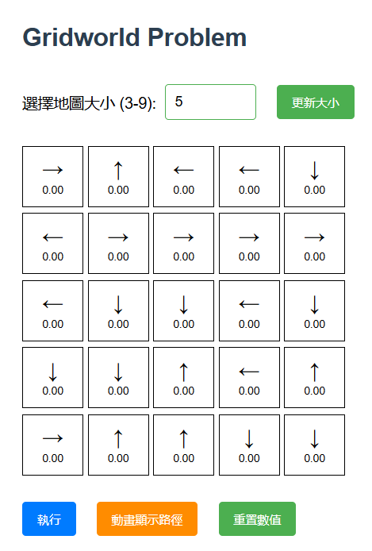
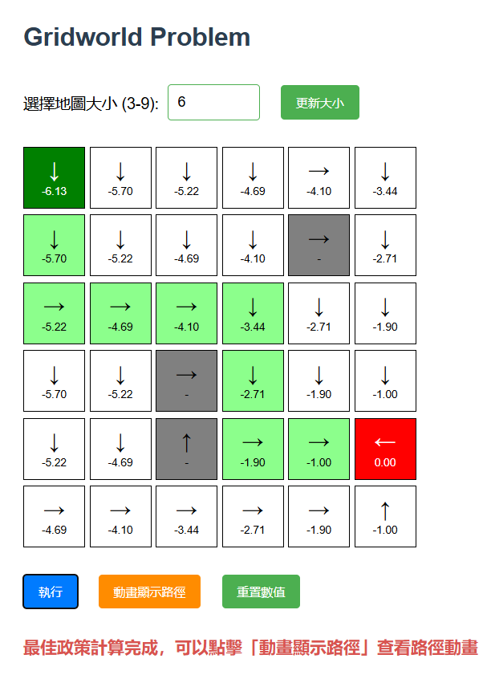

# DRL_HW02

## Solve Gridworld Problem using Value Iteration

### 1.概敘說明

#### 🎯 專案目的
本專案旨在建立一個直觀且可視化的互動式強化學習平台，讓使用者透過網頁介面操作 GridWorld 環境，並實際觀察「價值迭代（Value Iteration）」與「政策評估（Policy Evaluation）」如何求解出最適策略與狀態價值 `V(s)`。主要目標包括：

- ✅ 輔助理解強化學習中「狀態價值」與「行動策略」的概念
- ✅ 實作並展示經典強化學習演算法
- ✅ 即時視覺化策略與路徑推導過程
- ✅ 提供教學、展示與實驗用途
<br>

#### ⚙️ 系統功能特色
<center>

| 功能             | 說明                                                                 |
| :--: | :-- |
| ✅ 地圖大小調整   | 支援 3x3 ~ 9x9 動態調整網格大小                                       |
| ✅ 格子互動操作   | 點擊地圖格子可設定起點、終點與障礙物                                  |
| ✅ 即時價值迭代   | 後端計算 `V(s)` 並同步顯示每格價值與最佳方向                         |
| ✅ 政策箭頭顯示   | 每格上方顯示當前政策方向（↑ ↓ ← →）                                  |
| ✅ 路徑動畫展示   | 模擬從起點出發，逐步走向終點的最佳路徑動畫                             |
| ✅ 數值重置功能   | 清除所有 `V(s)` 及路徑顯示，便於重新設定                             |
</center>
<br>

#### 🧠 核心演算法

- **Value Iteration（價值迭代）**  
  對每個狀態反覆計算所有動作的期望回報，找出最佳策略與狀態價值。

- **Policy Evaluation（政策評估）**  
  固定策略下，評估每個狀態所獲得的預期報酬（僅更新 `V(s)`，不更改策略）。

- **Find Optimal Path（推導路徑）**  
  根據目前策略，模擬從起點到終點的行動步驟，找出可行路徑。

<br>

#### 🌐 技術架構

- **前端**：HTML、CSS、JavaScript（jQuery）
- **後端**：Python、Flask 框架
- **運算引擎**：使用 NumPy 進行價值函數與政策矩陣的運算
- **資料溝通**：前後端透過 AJAX JSON 傳輸政策、價值與地圖資訊

<br>

### 2.Code

#### 📁 `app.py`（後端 Flask 程式）

<br>

##### 🔹 基本設定與初始化

```python
from flask import Flask, render_template, request, jsonify
import random
import numpy as np

app = Flask(__name__)
```
➡ 引入 Flask、Numpy 等必要套件，供後端運算與 API 用。

```python
n = 5
grid = [["" for _ in range(n)] for _ in range(n)]
start = None
end = None
obstacles = set()
actions = ["↑", "↓", "←", "→"]
policy = [[random.choice(actions) for _ in range(n)] for _ in range(n)]
value_function = np.zeros((n, n))
```
➡ 初始值設定：地圖大小、策略、障礙物與狀態價值初始化。

---

##### 🔹 `evaluate_policy()`

```python
def evaluate_policy():
    ...
```
➡ 根據目前策略計算每格 V(s)，直到收斂（政策不改變，只改 V(s)）。

<br>

##### 🔹 `value_iteration()`

```python
def value_iteration():
    ...
```
➡ 根據每格上下左右四方向的最大期望報酬，更新 V(s) 並找出最佳策略。

<br>

##### 🔹 `find_optimal_path()`

```python
def find_optimal_path():
    ...
```
➡ 根據當前策略模擬從起點走到終點的路徑。若碰到障礙或循環則中止。

<br>

##### 🔹 Flask 路由設計

- `/`: 渲染主頁 index.html。
- `/set_size`: 設定地圖大小。
- `/update_cell`: 更新單元格狀態（起點/終點/障礙物）。
- `/evaluate_policy`: 執行政策評估。
- `/value_iteration`: 執行價值迭代並取得最佳策略與路徑。
- `/reset_values`: 重設所有狀態價值。

<br>

#### 📄 `index.html`（前端互動頁面）

##### 🔹 標頭與樣式

- 匯入 jQuery
- 設定網格樣式、按鈕樣式、動畫樣式

<br>

##### 🔹 主畫面功能區塊

- 地圖大小設定與按鈕操作
- 地圖格子會動態產生在 `#grid` 容器中
- 執行 / 動畫顯示 / 重置 按鈕

<br>

##### 🔹 JavaScript 程式功能

```js
generateGrid()
```
➡ 根據後端資料建立地圖格子並填入箭頭與 V(s)
<br>
```js
updateCell(x, y)
```
➡ 點擊格子設定起點、終點或障礙物並呼叫後端 API 更新狀態
<br>
```js
executeAlgorithm()
```
➡ 呼叫 /value_iteration，取得最新策略與值函數並更新畫面
<br>
```js
animatePath()
```
➡ 顯示最佳路徑動畫（逐格高亮）
<br>
```js
resetValues()
```
➡ 重置所有格子數值並清除路徑顯示

<br>

#### ✅ 總結

本專案由 Flask + HTML + JS 組成：

- 後端 app.py 負責 RL 演算法與 API 回應
- 前端 index.html 提供互動式操作與視覺化展示

#### app.py
```python=
from flask import Flask, render_template, request, jsonify
import random
import numpy as np

app = Flask(__name__)

# 初始化地圖
n = 5  # 預設大小
grid = [["" for _ in range(n)] for _ in range(n)]
start = None
end = None
obstacles = set()
actions = ["↑", "↓", "←", "→"]
policy = [[random.choice(actions) for _ in range(n)] for _ in range(n)]
value_function = np.zeros((n, n))

def evaluate_policy():
    """簡單的政策評估，計算 V(s)"""
    global value_function
    gamma = 0.9  # 折扣因子
    delta = 1e-3  # 收斂閾值

    while True:
        new_value_function = np.copy(value_function)
        for i in range(n):
            for j in range(n):
                if (i, j) in obstacles or (i, j) == start or (i, j) == end:
                    continue
                action = policy[i][j]
                ni, nj = i, j
                if action == "↑" and i > 0: ni -= 1
                elif action == "↓" and i < n-1: ni += 1
                elif action == "←" and j > 0: nj -= 1
                elif action == "→" and j < n-1: nj += 1
                new_value_function[i, j] = -1 + gamma * value_function[ni, nj]

        if np.max(np.abs(new_value_function - value_function)) < delta:
            break
        value_function = new_value_function

def value_iteration():
    """價值迭代算法，計算最佳政策"""
    global value_function, policy
    gamma = 0.9  # 折扣因子
    delta = 1e-3  # 收斂閾值
    
    # 初始化價值函數
    value_function = np.zeros((n, n))
    
    # 設置終點價值
    if end:
        value_function[end[0], end[1]] = 0
    
    # 障礙物的處理方式修改：不顯示為無限值
    for i in range(n):
        for j in range(n):
            if (i, j) in obstacles:
                value_function[i, j] = -100  # 使用很低的值而非無限
    
    while True:
        delta_value = 0
        new_value_function = np.copy(value_function)
        
        for i in range(n):
            for j in range(n):
                if (i, j) in obstacles or (i, j) == end:
                    continue
                
                # 計算每個動作的價值
                action_values = []
                
                # 向上
                if i > 0 and (i-1, j) not in obstacles:
                    action_values.append((-1 + gamma * value_function[i-1, j], "↑"))
                else:
                    action_values.append((-1 + gamma * value_function[i, j], "↑"))
                
                # 向下
                if i < n-1 and (i+1, j) not in obstacles:
                    action_values.append((-1 + gamma * value_function[i+1, j], "↓"))
                else:
                    action_values.append((-1 + gamma * value_function[i, j], "↓"))
                
                # 向左
                if j > 0 and (i, j-1) not in obstacles:
                    action_values.append((-1 + gamma * value_function[i, j-1], "←"))
                else:
                    action_values.append((-1 + gamma * value_function[i, j], "←"))
                
                # 向右
                if j < n-1 and (i, j+1) not in obstacles:
                    action_values.append((-1 + gamma * value_function[i, j+1], "→"))
                else:
                    action_values.append((-1 + gamma * value_function[i, j], "→"))
                
                # 找出最佳動作及其價值
                best_value, best_action = max(action_values)
                
                # 更新價值函數和政策
                new_value_function[i, j] = best_value
                policy[i][j] = best_action
                
                # 計算變化量
                delta_value = max(delta_value, abs(new_value_function[i, j] - value_function[i, j]))
        
        # 更新價值函數
        value_function = new_value_function
        
        # 檢查是否收斂
        if delta_value < delta:
            break

def find_optimal_path():
    """基於當前政策找出從起點到終點的最佳路徑"""
    if not start or not end:
        return []
    
    path = [start]
    current = start
    
    # 防止無限循環
    max_steps = n * n
    step_count = 0
    
    while current != end and step_count < max_steps:
        i, j = current
        action = policy[i][j]
        
        # 根據政策確定下一步
        ni, nj = i, j
        if action == "↑" and i > 0: ni -= 1
        elif action == "↓" and i < n-1: ni += 1
        elif action == "←" and j > 0: nj -= 1
        elif action == "→" and j < n-1: nj += 1
        
        # 如果下一步是障礙物或走出邊界，結束
        if (ni, nj) in obstacles or ni < 0 or ni >= n or nj < 0 or nj >= n:
            break
        
        current = (ni, nj)
        path.append(current)
        step_count += 1
        
        # 如果回到已經訪問過的狀態，表示存在循環，則跳出
        if path.count(current) > 1:
            break
    
    # 檢查是否達到終點
    if current != end:
        return []  # 找不到有效路徑
    
    return path

@app.route('/')
def index():
    return render_template("index.html", n=n, grid=grid, policy=policy, value_function=value_function.tolist())

@app.route('/set_size', methods=['POST'])
def set_size():
    global n, grid, policy, value_function, obstacles, start, end
    data = request.json
    n = data["size"]
    grid = [["" for _ in range(n)] for _ in range(n)]
    policy = [[random.choice(actions) for _ in range(n)] for _ in range(n)]
    value_function = np.zeros((n, n))
    obstacles.clear()
    start = None
    end = None
    return jsonify({
        "message": "Grid size updated", 
        "n": n, 
        "policy": policy, 
        "values": value_function.tolist()
    })

@app.route('/update_cell', methods=['POST'])
def update_cell():
    global start, end, obstacles
    data = request.json
    x, y = data["x"], data["y"]
    message = ""
    do_not_iterate = data.get("doNotIterate", False)

    # 點擊設置起點、終點和障礙物
    if (x, y) == start:
        start = None  # 移除起點
        message = "起點已移除"
    elif (x, y) == end:
        end = None  # 移除終點
        message = "終點已移除"
    elif (x, y) in obstacles:
        obstacles.remove((x, y))  # 移除障礙物
        message = "障礙物已移除"
    elif not start:  # 設置起點
        start = (x, y)
        message = "起點已設置"
    elif not end:  # 設置終點
        end = (x, y)
        message = "終點已設置"
        # 當終點被設置後，如果不是禁止迭代的請求，自動執行價值迭代
        if start and end and not do_not_iterate:
            value_iteration()
            path = find_optimal_path()
            return jsonify({
                "message": message,
                "runIteration": True,
                "values": value_function.tolist(),
                "policy": policy,
                "path": path
            })
    else:  # 設置障礙物
        obstacles.add((x, y))
        message = "障礙物已設置"
        # 如果起點和終點都已設置，且不是禁止迭代的請求，自動執行價值迭代
        if start and end and not do_not_iterate:
            value_iteration()
            path = find_optimal_path()
            return jsonify({
                "message": message,
                "runIteration": True,
                "values": value_function.tolist(),
                "policy": policy,
                "path": path
            })
    
    return jsonify({"message": message, "runIteration": False})

@app.route('/evaluate_policy', methods=['POST'])
def evaluate():
    evaluate_policy()
    return jsonify({"message": "政策評估完成", "values": value_function.tolist()})

@app.route('/value_iteration', methods=['POST'])
def run_value_iteration():
    value_iteration()
    path = find_optimal_path()
    return jsonify({
        "message": "價值迭代完成",
        "values": value_function.tolist(),
        "policy": policy,
        "path": path
    })

@app.route('/reset_values', methods=['POST'])
def reset_values():
    global value_function
    value_function = np.zeros((n, n))
    return jsonify({"message": "Values reset", "values": value_function.tolist()})

if __name__ == "__main__":
    app.run(debug=True)

```
<br>

#### index.html
```python=
<!DOCTYPE html>
<html lang="zh">
<head>
    <meta charset="UTF-8">
    <meta name="viewport" content="width=device-width, initial-scale=1.0">
    <title>Gridworld Problem</title>
    <script src="https://code.jquery.com/jquery-3.6.0.min.js"></script>
    <style>
        body {
            font-family: Arial, sans-serif;
            margin: 40px;  /* 增加邊距 */
        }
        .grid-container {
            display: grid;
            gap: 10px; /* 增加格子間距 */
            margin: 30px 0;
        }
        .cell {
            width: 100px; /* 增加格子大小 */
            height: 100px;
            border: 2px solid black; /* 加粗邊框 */
            text-align: center;
            font-size: 24px; /* 增加字體大小 */
            display: flex;
            flex-direction: column;
            align-items: center;
            justify-content: center;
            cursor: pointer;
            position: relative;
        }
        .start { background-color: green; color: white; }
        .end { background-color: red; color: white; }
        .obstacle { background-color: gray; }
        .policy {
            font-size: 36px; /* 增加箭頭大小 */
            margin-bottom: 5px;
        }
        .value {
            font-size: 18px; /* 增加數值大小 */
        }
        
        /* 按鈕樣式 */
        button {
            background-color: #4CAF50;
            color: white;
            padding: 15px 25px;
            border: none;
            border-radius: 6px;
            cursor: pointer;
            font-size: 20px;
            margin-right: 20px;
            margin-top: 15px;
            margin-bottom: 15px;
        }
        
        button:hover {
            background-color: #45a049;
        }
        
        /* 輸入框樣式 */
        input[type="number"] {
            padding: 15px;
            width: 120px;
            margin-right: 20px;
            font-size: 24px;
            border: 2px solid #4CAF50;
            border-radius: 6px;
        }
        
        /* 控制區域樣式 */
        .controls {
            margin-bottom: 30px;
            font-size: 26px;
            display: flex;
            align-items: center;
            flex-wrap: wrap;
            gap: 15px;
        }
        
        /* 標題樣式 */
        h2 {
            font-size: 42px;
            margin-bottom: 40px;
            color: #2c3e50;
        }
        
        /* 狀態訊息樣式 */
        #status {
            font-size: 28px;
            color: #d9534f;
            margin-top: 25px;
            height: 40px;
            font-weight: bold;
        }
        
        .path { background-color: #8CFF8C; }  /* 淺綠色表示路徑 */
        
        /* 添加終點訪問的樣式 */
        .end-visited { 
            background-color: #FF9E9E; /* 淺紅色表示已訪問的終點 */
            color: white;
        }
    </style>
</head>
<body>

    <h2>Gridworld Problem</h2>
    
    <div class="controls">
        <label for="size">選擇地圖大小 (3-9): </label>
        <input type="number" id="size" min="3" max="9" value="{{ n }}">
        <button onclick="setGridSize()">更新大小</button>
    </div>

    <div id="grid" class="grid-container"></div>
    
    <div class="controls">
        <button onclick="executeAlgorithm()" style="background-color: #007bff;">執行</button>
        <button onclick="animatePath()" style="background-color: #ff8c00;">動畫顯示路徑</button>
        <button onclick="resetValues()">重置數值</button>
    </div>
    
    <div id="status"></div>

    <script>
        let n = {{ n }};
        let start = null;
        let end = null;
        let obstacles = new Set();
        let policy = {{ policy|tojson }};
        let values = {{ value_function|tojson }};
        let optimalPath = [];  // 存儲最佳路徑

        // 新增用於動畫路徑的變數
        let isAnimating = false;
        let animationSpeed = 500; // 動畫速度，單位為毫秒

        function generateGrid() {
            $("#grid").empty().css("grid-template-columns", `repeat(${n}, 100px)`);
            for (let i = 0; i < n; i++) {
                for (let j = 0; j < n; j++) {
                    let cell = $("<div>").addClass("cell").attr("data-x", i).attr("data-y", j);
                    
                    // 添加政策箭頭
                    let policyDiv = $("<div>").addClass("policy").text(policy[i][j]);
                    cell.append(policyDiv);
                    
                    // 添加價值函數
                    let valueDiv = $("<div>").addClass("value").text(values[i][j].toFixed(2));
                    cell.append(valueDiv);
                    
                    cell.click(() => updateCell(i, j));
                    $("#grid").append(cell);
                }
            }
            
            // 重新標記起點、終點、障礙物和路徑
            if (start) {
                $(`.cell[data-x=${start[0]}][data-y=${start[1]}]`).addClass("start");
            }
            if (end) {
                $(`.cell[data-x=${end[0]}][data-y=${end[1]}]`).addClass("end");
            }
            obstacles.forEach(obs => {
                const [x, y] = obs.split(',').map(Number);
                $(`.cell[data-x=${x}][data-y=${y}]`).addClass("obstacle");
            });
            
            // 標記最佳路徑
            showOptimalPath();
        }

        function setGridSize() {
            let size = $("#size").val();
            $.ajax({
                url: "/set_size",
                type: "POST",
                contentType: "application/json",
                data: JSON.stringify({ size: parseInt(size) }),
                success: function(data) {
                    n = data.n;
                    policy = data.policy;
                    values = data.values;
                    resetObstaclesStartEnd();
                    optimalPath = []; // 重置路徑
                    generateGrid();
                }
            });
        }

        function resetObstaclesStartEnd() {
            obstacles = new Set();
            start = null;
            end = null;
        }

        function updateCell(x, y) {
            // 檢查是否點擊的是起點
            if (start && start[0] === x && start[1] === y) {
                $(".start").removeClass("start");
                start = null;
                
                // 清除路徑
                optimalPath = [];
                $(".path").removeClass("path");
                
                $.ajax({
                    url: "/update_cell",
                    type: "POST",
                    contentType: "application/json",
                    data: JSON.stringify({ x, y }),
                    success: function(response) {
                        // 只顯示消息，不執行迭代
                        $("#status").text(response.message);
                        setTimeout(() => $("#status").text(""), 3000);
                    }
                });
                return;
            }
            
            // 檢查是否點擊的是終點
            if (end && end[0] === x && end[1] === y) {
                $(".end").removeClass("end");
                end = null;
                
                // 清除路徑
                optimalPath = [];
                $(".path").removeClass("path");
                
                $.ajax({
                    url: "/update_cell",
                    type: "POST",
                    contentType: "application/json",
                    data: JSON.stringify({ x, y }),
                    success: function(response) {
                        // 只顯示消息，不執行迭代
                        $("#status").text(response.message);
                        setTimeout(() => $("#status").text(""), 3000);
                    }
                });
                return;
            }
            
            // 檢查是否點擊的是障礙物
            if (obstacles.has(`${x},${y}`)) {
                let cell = $(`.cell[data-x=${x}][data-y=${y}]`);
                cell.removeClass("obstacle");
                obstacles.delete(`${x},${y}`);
                
                $.ajax({
                    url: "/update_cell",
                    type: "POST",
                    contentType: "application/json",
                    data: JSON.stringify({ x, y, doNotIterate: true }),
                    success: function(response) {
                        // 只顯示消息，不執行迭代
                        $("#status").text(response.message);
                        setTimeout(() => $("#status").text(""), 3000);
                    },
                    error: function() {
                        cell.addClass("obstacle");
                        obstacles.add(`${x},${y}`);
                    }
                });
                return;
            }

            // 設置新的起點
            if (!start) {
                let cell = $(`.cell[data-x=${x}][data-y=${y}]`);
                cell.addClass("start");
                start = [x, y];
                
                $.ajax({
                    url: "/update_cell",
                    type: "POST",
                    contentType: "application/json",
                    data: JSON.stringify({ x, y, doNotIterate: true }),
                    success: function(response) {
                        // 只顯示消息，不執行迭代
                        $("#status").text(response.message);
                        setTimeout(() => $("#status").text(""), 3000);
                    },
                    error: function() {
                        cell.removeClass("start");
                        start = null;
                    }
                });
                return;
            }

            // 設置終點
            if (!end) {
                let cell = $(`.cell[data-x=${x}][data-y=${y}]`);
                cell.addClass("end");
                end = [x, y];
                
                $.ajax({
                    url: "/update_cell",
                    type: "POST",
                    contentType: "application/json",
                    data: JSON.stringify({ x, y, doNotIterate: true }),
                    success: function(response) {
                        // 只顯示消息，不執行迭代
                        $("#status").text(response.message);
                        setTimeout(() => $("#status").text(""), 3000);
                    },
                    error: function() {
                        cell.removeClass("end");
                        end = null;
                    }
                });
                return;
            }

            // 設置障礙物
            if (obstacles.size < n - 2) {
                let cell = $(`.cell[data-x=${x}][data-y=${y}]`);
                cell.addClass("obstacle");
                obstacles.add(`${x},${y}`);
                
                $.ajax({
                    url: "/update_cell",
                    type: "POST",
                    contentType: "application/json",
                    data: JSON.stringify({ x, y, doNotIterate: true }),
                    success: function(response) {
                        // 只顯示消息，不執行迭代
                        $("#status").text(response.message);
                        setTimeout(() => $("#status").text(""), 3000);
                    },
                    error: function() {
                        cell.removeClass("obstacle");
                        obstacles.delete(`${x},${y}`);
                    }
                });
            } else {
                $("#status").text(`已達到障礙物數量上限 (${n-2} 個)`);
                setTimeout(() => $("#status").text(""), 3000);
            }
        }
        
        function handleUpdateResponse(response) {
            $("#status").text(response.message);
            
            // 如果需要執行價值迭代（在設置終點或添加/刪除障礙物時）
            if (response.runIteration) {
                values = response.values;
                policy = response.policy;
                optimalPath = response.path;
                
                // 更新每個格子的值和政策
                for (let i = 0; i < n; i++) {
                    for (let j = 0; j < n; j++) {
                        let cell = $(`.cell[data-x=${i}][data-y=${j}]`);
                        cell.find(".policy").text(policy[i][j]);
                        cell.find(".value").text(formatValue(values[i][j]));
                    }
                }
                
                // 顯示最佳路徑
                showOptimalPath();
                
                $("#status").text("最佳政策已計算");
                setTimeout(() => $("#status").text(""), 3000);
            }
        }
        
        // 格式化價值函數，避免顯示Infinity
        function formatValue(value) {
            if (value === -Infinity || value < -99) {
                return "-";
            }
            return value.toFixed(2);
        }
        
        // 新增執行按鈕的功能
        function executeAlgorithm() {
            if (!start || !end) {
                $("#status").text("請先設置起點和終點");
                setTimeout(() => $("#status").text(""), 3000);
                return;
            }
            
            $("#status").text("價值迭代計算中...");
            $.ajax({
                url: "/value_iteration",
                type: "POST",
                contentType: "application/json",
                success: function(data) {
                    values = data.values;
                    policy = data.policy;
                    optimalPath = data.path;
                    
                    // 更新每個格子的值和政策
                    for (let i = 0; i < n; i++) {
                        for (let j = 0; j < n; j++) {
                            let cell = $(`.cell[data-x=${i}][data-y=${j}]`);
                            cell.find(".policy").text(policy[i][j]);
                            cell.find(".value").text(formatValue(values[i][j]));
                        }
                    }
                    
                    // 顯示最佳路徑（改為靜態顯示，不含動畫）
                    showOptimalPath();
                    
                    $("#status").text("最佳政策計算完成，可以點擊「動畫顯示路徑」查看路徑動畫");
                    setTimeout(() => $("#status").text(""), 5000);
                }
            });
        }
        
        // 顯示最佳路徑（靜態顯示）
        function showOptimalPath() {
            // 清除之前的路徑標記
            $(".path").removeClass("path");
            
            // 標記新的路徑
            optimalPath.forEach(point => {
                const [x, y] = point;
                // 不對起點和終點添加路徑樣式
                if ((x !== start[0] || y !== start[1]) && (x !== end[0] || y !== end[1])) {
                    $(`.cell[data-x=${x}][data-y=${y}]`).addClass("path");
                }
            });
        }
        
        // 動畫顯示路徑
        function animatePath() {
            // 檢查是否有路徑可供顯示
            if (!optimalPath || optimalPath.length < 2) {
                $("#status").text("沒有可用的路徑，請先執行價值迭代");
                setTimeout(() => $("#status").text(""), 3000);
                return;
            }
            
            // 如果已經在動畫中，則不重新開始
            if (isAnimating) {
                return;
            }
            
            // 設置動畫標記
            isAnimating = true;
            
            // 清除所有路徑標記和終點訪問標記
            $(".path").removeClass("path");
            $(".end").removeClass("end-visited");
            
            // 顯示當前位置在起點
            let currentIndex = 0;
            $("#status").text(`動畫顯示：已從起點出發（第1步，共${optimalPath.length}步）`);
            
            // 設置定時器逐步顯示路徑
            let pathInterval = setInterval(() => {
                currentIndex++;
                
                // 如果已經到達終點，清除定時器並標記終點為已訪問
                if (currentIndex >= optimalPath.length) {
                    clearInterval(pathInterval);
                    isAnimating = false;
                    
                    // 標記終點為已訪問
                    $(`.cell[data-x=${end[0]}][data-y=${end[1]}]`).addClass("end-visited");
                    
                    $("#status").text("路徑動畫顯示完成，已到達終點！");
                    setTimeout(() => $("#status").text(""), 3000);
                    return;
                }
                
                // 獲取當前格子位置
                const [x, y] = optimalPath[currentIndex];
                
                // 標記當前格子
                if (x === end[0] && y === end[1]) {
                    // 如果是終點，添加終點訪問樣式
                    $(`.cell[data-x=${x}][data-y=${y}]`).addClass("end-visited");
                } else {
                    // 如果不是終點，就添加路徑樣式
                    $(`.cell[data-x=${x}][data-y=${y}]`).addClass("path");
                }
                
                // 更新狀態消息
                $("#status").text(`動畫顯示：步驟 ${currentIndex + 1}/${optimalPath.length}`);
                
                // 如果已經到達終點，立即結束動畫
                if (x === end[0] && y === end[1]) {
                    clearInterval(pathInterval);
                    isAnimating = false;
                    $("#status").text("路徑動畫顯示完成，已到達終點！");
                    setTimeout(() => $("#status").text(""), 3000);
                }
            }, animationSpeed);
        }
        
        function resetValues() {
            $.ajax({
                url: "/reset_values",
                type: "POST",
                contentType: "application/json",
                success: function(data) {
                    values = data.values;
                    for (let i = 0; i < n; i++) {
                        for (let j = 0; j < n; j++) {
                            $(`.cell[data-x=${i}][data-y=${j}]`).find(".value").text(values[i][j].toFixed(2));
                        }
                    }
                    // 清除路徑和終點訪問樣式
                    optimalPath = [];
                    $(".path").removeClass("path");
                    $(".end").removeClass("end-visited");
                    $("#status").text("數值已重置");
                }
            });
        }

        $(document).ready(() => generateGrid());
    </script>

</body>
</html>
```

### 3.Prompt 規劃概念


#### 🧩 Step 1: Backend Setup - Flask App Initialization

**Prompt:**

> 使用 Python 建立一個 Flask 應用，初始化地圖為 n x n 網格（預設為 5x5），使用 NumPy 初始化一個零矩陣代表狀態價值 `value_function`。每個格子隨機給定一個箭頭作為初始政策（↑↓←→）。

✅ 輸出應包含：`app = Flask(__name__)`、`grid`, `policy`, `value_function` 等變數初始化。

#### 🧩 Step 2: Define Value Iteration and Policy Evaluation

**Prompt:**

> 請實作兩個函式：
> - `value_iteration()`：根據上下左右的報酬與折扣因子，反覆計算每格最佳策略與 V(s)，直到收斂。
> - `evaluate_policy()`：根據目前的政策 `policy` 計算每個狀態的 V(s)，但不更新政策。

使用 NumPy 操作，處理障礙格（懲罰 -100）、終點（V=0）等情況。

#### 🧩 Step 3: Find Optimal Path

**Prompt:**

> 請新增一個 `find_optimal_path()` 函式，根據目前的政策從起點模擬移動到終點，回傳路徑列表（如：[(0,0), (1,0), (2,0)]）。遇到障礙或循環就結束。
<br>

#### 🧩 Step 4: Create API Routes

**Prompt:**

> 為這個 Flask 應用新增以下 API 路由：

- `/`：回傳 index.html 並帶入目前 grid、policy、value_function
- `/set_size`：接收 JSON（包含 size），更新地圖大小並初始化資料
- `/update_cell`：設定起點、終點、障礙，並根據情況執行 value_iteration
- `/evaluate_policy`：執行政策評估
- `/value_iteration`：執行價值迭代並回傳結果與路徑
- `/reset_values`：將 V(s) 清空歸零

#### 🧩 Step 5: Build the Frontend Layout (HTML)

**Prompt:**

> 請建立一個 index.html，功能如下：

- 使用者可設定地圖大小（3~9）
- 地圖使用 CSS Grid 顯示，每格顯示：策略箭頭 + 數值 V(s)
- 點擊格子可設定為：
  - 起點（綠色）
  - 終點（紅色）
  - 障礙物（灰色）

請使用 jQuery 建立前端互動，與 Flask 後端 API 串接。

#### 🧩 Step 6: Add Execution Buttons and Grid Rendering

**Prompt:**

> 在 index.html 加入三個按鈕與其功能：
- 「執行」：呼叫 /value_iteration 並更新政策與 V(s)
- 「動畫顯示路徑」：依據回傳路徑逐格動畫顯示
- 「重置數值」：清空所有狀態價值

使用 AJAX 呼叫 Flask，更新畫面內容。

#### 🧩 Step 7: 完整整合與測試

**Prompt:**

> 整合所有部分，產生一個完整的 Flask 應用程式，包含：
- `app.py`：Flask 後端，所有函式與 API 完整串接
- `index.html`：互動式網頁，能更新格子、顯示箭頭、執行演算法與動畫顯示路徑

確認程式可以：
- 設定起點與終點
- 設定障礙物
- 成功執行 value iteration 並顯示最佳路徑
<br>

### 4. Policy Iteration（政策迭代）演算法簡介

#### 📌 什麼是 Policy Iteration？

Policy Iteration 是強化學習中一種用來求解最適策略（Optimal Policy）的方法。  
它是一種基於 **策略改進（Policy Improvement）** 與 **策略評估（Policy Evaluation）** 的疊代演算法，常用於有限狀態 MDP（馬可夫決策過程）中。

#### 🔁 演算法流程

Policy Iteration 包含以下兩個主要步驟，重複執行直到策略收斂：

##### 1. 🧮 **Policy Evaluation（策略評估）**

- 給定目前的策略 π(s)，計算每個狀態下的狀態價值 V(s)。
- 通常是透過迭代方式求解 V(s)，直到收斂。

公式如下：

```
V(s) = R(s) + γ * Σ P(s'|s, π(s)) * V(s')
```

##### 2. 🔁 **Policy Improvement（策略改進）**

- 根據已計算出的 V(s)，針對每個狀態找出使期望報酬最大的行動 a。
- 更新 π(s) 為新的最佳行動。
- 若策略不再改變，則收斂，停止迴圈。

#### ✅ 終止條件

當整個策略 π(s) 經過一次改進後 **不再變化**，代表已經收斂到最適策略，演算法結束。

#### 🧠 與 Value Iteration 比較

| 項目             | Policy Iteration               | Value Iteration                  |
|:--:|:--:|:--:|
| 核心概念         | 分開進行策略評估與改進         | 每次迭代同時更新 V(s)           |
| 評估方式         | 完整計算 V(s) 直到收斂         | 只做一次 Bellman 更新           |
| 收斂速度         | 一般步數少但每步花時間較多     | 每步快但總步數可能較多           |
| 可讀性           | 清楚拆成兩部分，容易理解       | 實作簡潔，適合大型空間           |

#### 📝 總結

Policy Iteration 是一種穩健、收斂速度快的強化學習方法，透過交替執行策略評估與改進，逐步逼近最適策略。當策略不再改變時，即可取得最終結果。

### 5.Demo 流程

以下為執行並展示本互動式 GridWorld 強化學習小專案的完整 Demo 流程

#### ✅ 1. 啟動環境與伺服器

##### 啟動 Flask 伺服器
```
python app.py
```

系統會在 `http://127.0.0.1:5000` 啟動本地伺服器。


#### 🌐 2. 開啟網頁介面

在瀏覽器中開啟：

```
http://localhost:5000
```

即可進入互動式地圖操作頁面。

<br>

#### 🧩 3. 操作流程步驟

##### 🔹 Step 1：設定地圖大小

- 可透過右上輸入框輸入地圖尺寸（3~9），點擊「更新大小」。

<br>

##### 🔹 Step 2：設定起點、終點與障礙物

- 點擊格子設定：
  - 第一次點 → 設為「起點」（綠色）
  - 第二次點 → 設為「終點」（紅色）
  - 第三次點 → 設為「障礙物」（灰色）
  - 再點一次可移除設定

設定完成後，系統會自動執行價值迭代（Value Iteration）以求解最佳策略。

<br>

##### 🔹 Step 3：觀察策略與狀態價值

- 每個格子會顯示：
  - 上方：箭頭（↑↓←→），代表最佳行動
  - 下方：狀態價值 V(s)

<br>

##### 🔹 Step 4：動畫展示最佳路徑

- 點擊「動畫顯示路徑」按鈕，可視覺化從起點到終點的策略路徑。
- 路徑會一格一格亮起，終點會變色表示成功抵達。

<br>

##### 🔹 Step 5：重置數值 / 重新設定

- 點擊「重置數值」按鈕，將所有 V(s) 清除為 0。
- 也可點格子重新設置起點、終點或障礙物。

<br>

#### 📦 Demo 搭配資料夾結構（參考）

```
├── app.py                # Flask 後端
├── templates/
│   └── index.html        # 主網頁前端
└── static/               # 可擴充用的靜態檔案夾（CSS/JS/圖示等）
```
### 6.結果呈現
<div style="display: flex; gap: 20px; justify-content: center; align-items: center;">

  
    <p>初始畫面</p>
  
    <p>執行後結果</p>
</div>

<br>
<br>
你可以在以下連結觀看本系統的操作影片：

[▶️ 點我觀看 YouTube 影片]([https://youtu.be/yaS2mcCdfeM?si=WvgyLGDL3-QOs-HK])
