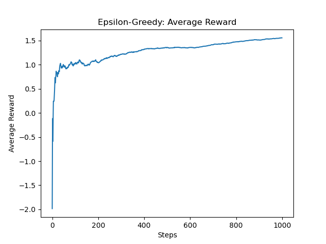
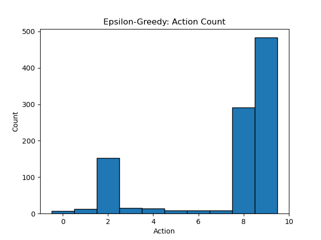
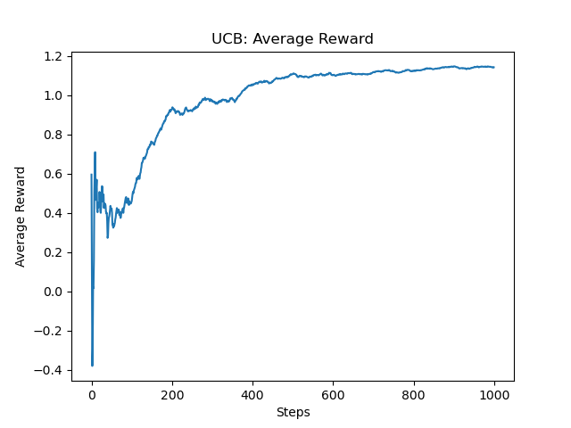
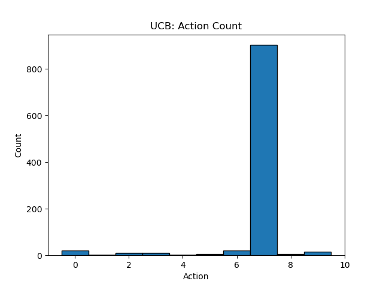
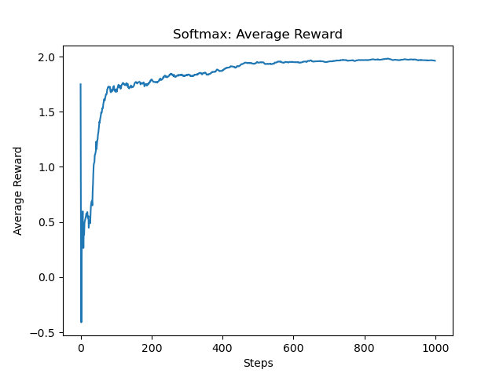
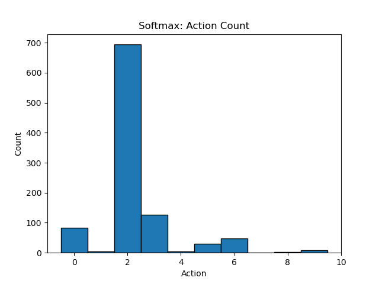

# HW3: Explore and Exploit for Arm-Bandit Problem

---

## 1. Epsilon-Greedy

### 📌 (1) 數學公式 (LaTeX)

$$
a_t = 
\begin{cases}
\text{random action}, & \text{with probability } \epsilon \\
\arg\max_a Q_t(a), & \text{with probability } 1 - \epsilon
\end{cases}
$$


### 🧠 (2) ChatGPT Prompt（含演算法說明）

請產生一個 epsilon-greedy 的 Python 程式碼來解決多臂賭徒問題。
Epsilon-Greedy 演算法透過設定一個探索率 ε，在每一次選擇中以 ε 的機率隨機探索，否則選擇目前預估報酬最大的臂（利用）。
請同時繪製每一輪的平均報酬與各臂被選擇的次數。


### 💻 (3) 程式碼與圖表
```python
import numpy as np
import matplotlib.pyplot as plt

def epsilon_greedy(k=10, steps=1000, epsilon=0.1):
    true_rewards = np.random.normal(0, 1, k)
    Q = np.zeros(k)
    N = np.zeros(k)
    rewards = []
    actions = []

    for t in range(steps):
        if np.random.rand() < epsilon:
            a = np.random.randint(k)
        else:
            a = np.argmax(Q)
        r = np.random.normal(true_rewards[a], 1)
        N[a] += 1
        Q[a] += (r - Q[a]) / N[a]
        rewards.append(r)
        actions.append(a)

    return rewards, actions

rewards, actions = epsilon_greedy()
average_rewards = np.cumsum(rewards) / (np.arange(len(rewards)) + 1)

plt.plot(average_rewards)
plt.title("Epsilon-Greedy: Average Reward")
plt.xlabel("Steps")
plt.ylabel("Average Reward")
plt.show()

plt.hist(actions, bins=np.arange(11)-0.5, edgecolor='black')
plt.title("Epsilon-Greedy: Action Count")
plt.xlabel("Action")
plt.ylabel("Count")
plt.show()
```



### 🧾 (4) 結果說明
- 適度探索（ε=0.1）可平衡探索與利用；
- 最常選擇報酬較高的拉霸臂；
- 圖表顯示報酬穩定提升。

---

## 2. Upper Confidence Bound (UCB)


### 📌 (1) 數學公式 (LaTeX)
$$
UCB_t(a) = Q_t(a) + c \sqrt{\frac{\ln t}{N_t(a)}}
$$

### 🧠 (2) ChatGPT Prompt（含演算法說明）

請用 Python 撰寫 UCB（Upper Confidence Bound）演算法。
UCB 方法兼顧當前報酬估計值與探索潛力，對選擇次數少的臂會給予更高的置信上限，從而進行探索。
請繪製平均報酬與各臂選擇次數的圖表。


### 💻 (3) 程式碼與圖表
```python
import numpy as np
import matplotlib.pyplot as plt
def ucb(k=10, steps=1000, c=2):
    true_rewards = np.random.normal(0, 1, k)
    Q = np.zeros(k)
    N = np.ones(k)
    rewards = []
    actions = []

    for t in range(1, steps+1):
        ucb_values = Q + c * np.sqrt(np.log(t) / N)
        a = np.argmax(ucb_values)
        r = np.random.normal(true_rewards[a], 1)
        N[a] += 1
        Q[a] += (r - Q[a]) / N[a]
        rewards.append(r)
        actions.append(a)

    return rewards, actions

rewards, actions = ucb()
avg_rewards = np.cumsum(rewards) / (np.arange(len(rewards)) + 1)

plt.plot(avg_rewards)
plt.title("UCB: Average Reward")
plt.xlabel("Steps")
plt.ylabel("Average Reward")
plt.show()

plt.hist(actions, bins=np.arange(11)-0.5, edgecolor='black')
plt.title("UCB: Action Count")
plt.xlabel("Action")
plt.ylabel("Count")
plt.show()
```



### 🧾 (4) 結果說明
- 初期探索較多，後期迅速收斂；
- 更快定位高報酬臂；
- 適合資訊不對稱或需積極探索的情況。

---

## 3. Softmax

### 📌 (1) 數學公式 (LaTeX)
$$
P(a) = \frac{e^{Q(a)/\tau}}{\sum_b e^{Q(b)/\tau}}
$$

### 🧠 (2) ChatGPT Prompt（含演算法說明）

請撰寫 Softmax MAB 策略的 Python 程式。
Softmax 透過溫度參數 τ 控制每個動作被選中的機率，τ 越小越偏向 exploitation，τ 越大越隨機。
請展示不同 τ 值下的表現差異。


### 💻 (3) 程式碼與圖表
```python
import numpy as np
import matplotlib.pyplot as plt
def softmax(Q, tau):
    exp_Q = np.exp(Q / tau)
    return exp_Q / np.sum(exp_Q)

def softmax_bandit(k=10, steps=1000, tau=0.5):
    true_rewards = np.random.normal(0, 1, k)
    Q = np.zeros(k)
    N = np.zeros(k)
    rewards = []
    actions = []

    for _ in range(steps):
        probs = softmax(Q, tau)
        a = np.random.choice(k, p=probs)
        r = np.random.normal(true_rewards[a], 1)
        N[a] += 1
        Q[a] += (r - Q[a]) / N[a]
        rewards.append(r)
        actions.append(a)

    return rewards, actions

rewards, actions = softmax_bandit()
avg_rewards = np.cumsum(rewards) / (np.arange(len(rewards)) + 1)

plt.plot(avg_rewards)
plt.title("Softmax: Average Reward")
plt.xlabel("Steps")
plt.ylabel("Average Reward")
plt.show()

plt.hist(actions, bins=np.arange(11)-0.5, edgecolor='black')
plt.title("Softmax: Action Count")
plt.xlabel("Action")
plt.ylabel("Count")
plt.show()
```



### 🧾 (4) 結果說明
- τ 控制探索程度，高 τ 導致平均報酬收斂慢；
- 較穩定探索方式，適合嘗試多種臂的場景；
- 可搭配動態 τ 改善早期學習。

---

## 4. Thompson Sampling

### 📌 (1) 數學公式 (LaTeX)
$$
\theta_a \sim \text{Beta}(\alpha_a, \beta_a), \\
a_t = \arg\max_a \theta_a
$$

### 🧠 (2) ChatGPT Prompt（含演算法說明）

請撰寫 Thompson Sampling 的 Python 程式。
此演算法為貝葉斯方法，對每個動作的成功機率建模為 Beta 分布，並從後驗分布中抽樣來做選擇。
請畫出每臂被選擇次數與平均報酬。


### 💻 (3) 程式碼與圖表
```python
import numpy as np
import matplotlib.pyplot as plt
def thompson_sampling(k=10, steps=1000):
    true_probs = np.random.rand(k)
    alpha = np.ones(k)
    beta_vals = np.ones(k)
    rewards = []
    actions = []

    for _ in range(steps):
        theta = np.random.beta(alpha, beta_vals)
        a = np.argmax(theta)
        reward = np.random.rand() < true_probs[a]
        alpha[a] += reward
        beta_vals[a] += 1 - reward
        rewards.append(reward)
        actions.append(a)

    return rewards, actions

rewards, actions = thompson_sampling()
avg_rewards = np.cumsum(rewards) / (np.arange(len(rewards)) + 1)

plt.plot(avg_rewards)
plt.title("Thompson Sampling: Average Reward")
plt.xlabel("Steps")
plt.ylabel("Average Reward")
plt.show()

plt.hist(actions, bins=np.arange(11)-0.5, edgecolor='black')
plt.title("Thompson Sampling: Action Count")
plt.xlabel("Action")
plt.ylabel("Count")
plt.show()
```


### 🧾 (4) 結果說明
- 能快速收斂至成功機率高的臂；
- 成本低、效率高，適合應用在點擊預測、推薦系統等；
- 對初始先驗設定較敏感，但平均表現優異。

---

