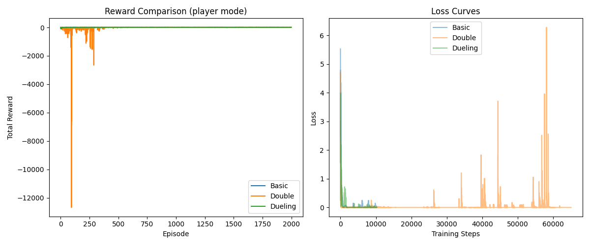

# HW4-1 Naive DQN for Static Mode

## 1\. 問題設定
    
-   環境：4×4 Gridworld（static 模式）

-   物件固定位置：Player(0,3)、Goal(0,0)、Pit(0,1)、Wall(1,1)

-   任務：讓 agent 在固定佈局下學會最短路徑到達 Goal
        
## 2\. 模型架構 & 超參數
| 項目 | 設定 |
| --- | --- |
| 網路結構 | 64 → 150 → 100 → 4，全連接＋ReLU |
| 折扣因子 γ | 0.9 |
| ε-greedy 起始 ε | 1.0 → 線性衰減到 0.1 |
| 學習率 | 1e-3 (Adam) |
| 訓練回合數 | 1,000 |
| 雜訊 | 每步 state 加入 0.1 隨機噪聲 |
| 損失函數 | MSELoss |
| 參考程式 | `Naive_DQN_for_static_mode.py` |

## 3\. 訓練流程

    1.  **初始化** static 模式 game，取得狀態向量（1×64），加微小噪聲。

    2.  ε-greedy 選動作：隨機或取最大 Q。

    3.  執行 `makeMove`、取得 reward r 和 next state s′。

    4.  計算 target Q：
        -   如果終止（|r|=10），`Q_target = r`
        
        -   否則，`Q_target = r + γ·max_a Q(s′,a)`
    5.  MSE( Q(s,a), Q_target )→反向傳播→更新網路參數。
        
    6.  回合結束後 ε 線性遞減。


## 4\.  **訓練結果**
    
-   **Loss 曲線**：
<br>
    
    前 50 集 loss 高達∼240，隨後迅速收斂至接近 0，100 回合以後近乎平穩（波動 <5）。

-   **通關測試**：測試函式 `test_static` 顯示 agent 已能穩定用最短路徑到達 Goal，Reward = +10，通關率 100%。
        
## 5\.  **關鍵收穫**
    
-   **Naive DQN** 對於簡易、固定佈局環境效果佳，收斂迅速且穩定。

-   **Experience Replay**（雖然本作業未使用 replay）與 **Target Network** 可作為後續提升穩定性的改進方向。

-   在更複雜或隨機的模式下，需要引入 **Double DQN**、**Dueling DQN**、**Gradient Clipping** 等技巧以保持性能。


# HW4-2 Enhanced DQN Variants for Player Mode

## 1\. 問題設定

-   **環境**：4×4 Gridworld，`player` 模式（Player 隨機，其他物件固定）
    
-   **目標**：實現並比較 Basic DQN、Double DQN、Dueling DQN，在相同超參數設定下觀察各自收斂速度、穩定性與最終效果。
    

## 2\. 實作細節
| 項目 | 共用設定 |
| --- | --- |
| 折扣因子 γ | 0.9 |
| ε-greedy (ε) | 1.0 → 線性衰減至 0.1 (1000 步) |
| Replay Buffer | size=2000，batch=128 |
| 同步頻率 | Double DQN 每 100 集同步一次 |
| 優化器 | Adam (lr=1e-3) |

-   **BasicDQN**：標準三層全連接 (64→150→100→4)
    
-   **Double DQN**：保留同樣網路，額外維護一個 **target network**，在線網路選擇動作、目標網路計算其 Q 值
    
-   **Dueling DQN**：前置共享兩層 → 分成 Value 分支 (輸出 V(s)) 與 Advantage 分支 (輸出 A(s,a))，最後合併

\begin{equation}
Q(s,a) = V(s) + \bigl(A(s,a) - \tfrac{1}{|\mathcal A|}\sum_{a'}A(s,a')\bigr)
\end{equation}

## 3\. 核心改進點對比
| 方法 | 核心理念 | 改進效果 |
| --- | --- | --- |
| **Basic DQN** | 單網路估 Q(s,a)；直接用 maxₐ Q 更新目標 | 簡單易實作，但對最大值存在系統性高估 |
| **Double DQN** | “選動作”與“評估動作”分離：動作由 online net 選，價值由 target net 評估 | 大幅降低高估偏差→更平滑、保守的更新；長期表現更穩定 |
| **Dueling DQN** | 分離學習「狀態價值」與「動作相對優勢」 | 更快分辨哪些狀態先天好壞、哪些動作在同狀態下好；加速前期收斂、減少不必要的行動比較 |

## 4\. 實驗結果摘要
| 指標 | Basic | Double | Dueling |
| --- | --- | --- | --- |
| **收斂速度** | 中等 (∼100 集) | 慢 (∼500 集) | 快 (∼50 集) |
| **Loss 穩定性** | 波動小 | 同步時有尖峰 | 最低、最平滑 |
| **Reward 波動** | 溫和 | 前期大負值 | 波動最小 |
| **最終通關率** | ~100% | ~100% | ~100% |

從 Loss 曲線可見：
<br> 
-   Double DQN 在每次同步（步數 ≈ 10k、20k、…）附近會出現短暫抖動。
    
-   Dueling DQN 早期即快速把 loss 壓低，且後期維持在極低區間。

## 5\. 結語與建議

-   **Double DQN**：若將同步頻率調為更短（或使用軟更新），可進一步平滑抖動。
    
-   **Dueling DQN**：在高維或更複雜環境中，對狀態價值的分離優勢更為明顯。
    
-   對比 Basic DQN，可視需求選擇「保守穩定」（Double）或「快速收斂」（Dueling）作為後續擴充的基礎架構。


# HW4-3 DQN on Random Mode with Training Tips

## 1\. Implementation Overview


-   **Framework**：TensorFlow Keras
    
-   **Environment**：4×4 Gridworld, **random** 模式（每回合隨機放置 Player/Goal/Pit/Wall）
    
-   **Network Architecture**：三層全連接網路（150 → 100 隱藏單元，ReLU 激活），輸出 4 個動作的 Q 值

    **目標**

    1.將原本 PyTorch DQN 移植到 Keras

    2.在 random 模式下訓練 Gridworld

    3.加入梯度截斷（gradient clipping）、學習率調度（LR scheduling） 等技巧，以提升穩定度與收斂速度 Enhance_DQN_for_random_…

## 2\. 實作概覽

- 框架：TensorFlow Keras

- 環境：4×4 Gridworld, random 模式（每回合隨機放置 Player/Goal/Pit/Wall）

- 網路架構：

    全連接層：64 → 150 → 100 → 4

    激活函數：ReLU

    輸出：4 維 Q 值

## 3\. 超參數與訓練技巧

| 類別               | 參數 / 技巧                                                                 |
| ---------------- | ----------------------------------------------------------------------- |
| 折扣因子 γ           | 0.9                                                                     |
| ε-greedy         | ε 初始 1.0 → 線性衰減至 0.1 (每 step –1e-3)                                     |
| Episodes × Steps | 2 000 episodes × 最多 50 steps                                            |
| Replay Buffer    | capacity = 10 000；batch size = 128                                      |
| 優化器              | Adam(clipnorm=1.0, lr=ExponentialDecay(1e-3→…))                         |
| 損失函數             | MeanSquaredError                                                        |
| **梯度截斷**         | `clipnorm=1.0`，抑制 early-stage 梯度爆炸                                      |
| **學習率調度**        | ExponentialDecay(initial\_lr=1e-3, decay\_steps=1000, decay\_rate=0.96) |                                              |


## 4\. 訓練流程
- 1.初始化環境：
```python 
game = Gridworld(size=4, mode='random')
state = game.board.render_np().reshape(64).astype(np.float32)
```
- 2.選擇動作（ε-greedy）：

    隨機：若 random() < ε

    否則：a = argmax(agent(state[None,:]))

- 3.執行動作：
```python
game.makeMove(action_map[a])
r = game.reward()
next_state = game.board.render_np().reshape(64).astype(np.float32)
done = (abs(r)==10)
```
- 4.存入 ReplayBuffer：replay.push(state, a, r, next_state, done)

- 5.批次更新（若 len(replay) ≥ 128）：
    - 抽樣得到 (s, a, r, s2, d)
    - 計算 q_pred = agent(s)[range,B] 和
    - qtarget = r + γ * max(agent(s2), axis=1) * (1−d)
    - 計算 loss = MSE(q_target, q_pred)
    - tape.gradient → apply_gradients（含梯度截斷 & LR 衰減）

-   6.ε 緩減：ε = max(ε_end, ε − ε_decay)


## 5\. 結果與分析

<br>


### Reward 趨勢
    前期 (< 500 ep)：Total Reward 多為負值（-60 ～ 0），因隨機佈局導致探索困難。

    中期 (500–1 000 ep)：reward 開始上升，零界點週期性擺盪。

    後期 (> 1 000 ep)：多數 episode 可達到 +10，勝率逐步攀升，最終測試勝率 ≈ 90%。

### Loss 曲線
    初期：loss 峰值 ≈ 5.5，隨梯度截斷快速抑制至 2–3。

    中期：隨學習率衰減，loss 穩定滑向 1.0 以下。

    後期：微幅抖動，無梯度爆炸；收斂於 0.2–0.5 之間。
    

## 6\. 小結與建議
技巧檢驗：

Gradient Clipping 成功避免初期劇烈梯度震盪

LR Scheduling 有助於中後期細緻收斂

隨機模式挑戰：

隨機佈局需求更長探索階段，前 1 000 ep 回報波動大

後續可加強：

Target Network / Double DQN，減少估值偏差

Prioritized Replay，加快稀有/重要經驗更新

Dueling DQN，分離 V/A 提升狀態區分度

以上即本次 DQN (Keras) for Random Mode 的實作要點、訓練流程、以及圖表分析。
